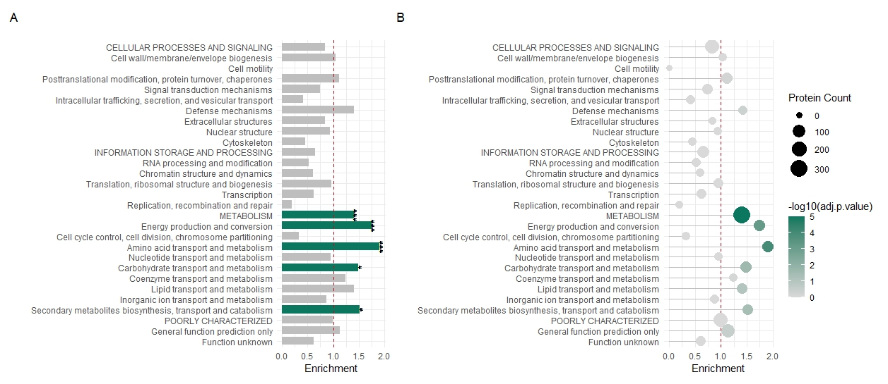
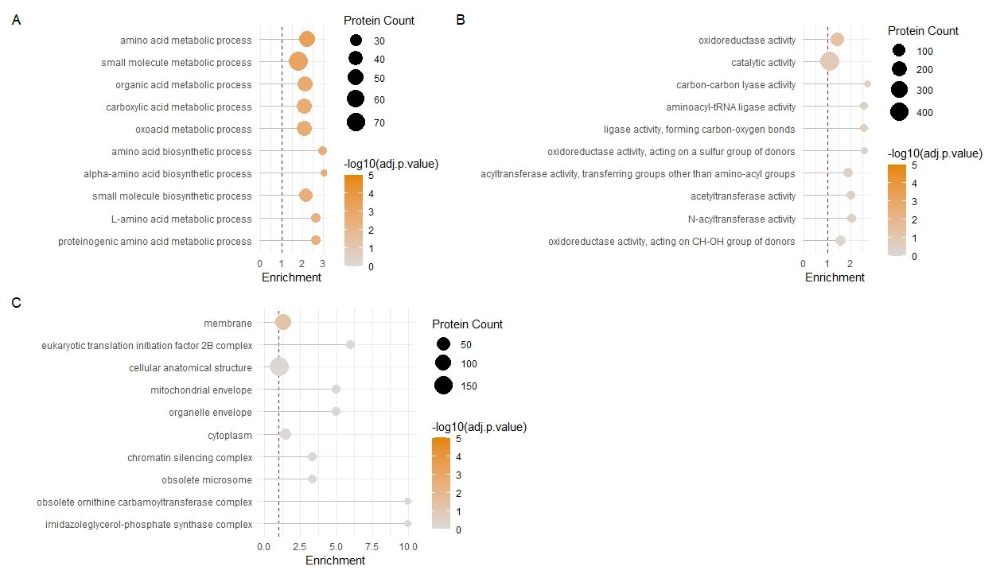
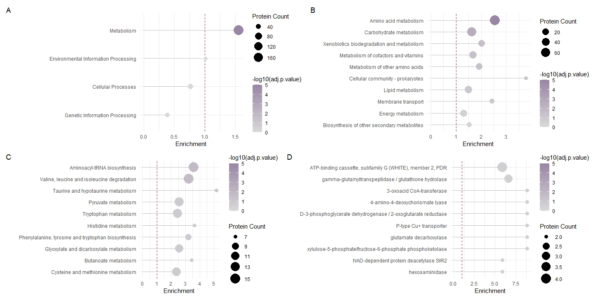

# FunFEA: an R Package for Fungal Functional Enrichment Analysis

### Overview  
*FunFEA* is an R package for functional enrichment analysis of fungal genomes. It allows users to build enrichment-ready models from COG/KOG, GO, and KEGG pathway annotations and perform enrichment analysis using transcriptomics or proteomics data. 

Authors: Julien Charest & Paul Loebenstein

Key features:  
- Supports COG/KOG, GO, and KEGG pathway enrichment analysis from publicly available or *eggNOG-mapper* annotations.  
- Includes pre-generated models for commonly studied fungal species.  
- Provides *ggplot2*-based visualization tools for enrichment results.  
- Compatible with *patchwork* for figure panel generation.  

### Installation  

You can install the [latest release](https://github.com/julien-charest/funfea/releases/tag/v1.2.0) from GitHub:  

```r
# Install FunFEA dependencies if not already installed
install.packages(c("ggplot2", "tidyr", "igraph", "dplyr"), dependencies = TRUE)

# Install FunFEA from latest build
install.packages("/path/to/funfea_1.2.0.tar.gz", repos = NULL, type = "source")
```

### Using FunFEA
#### Loading Precomputed Models
FunFEA provides precomputed functional annotation models for commonly studied fungal species. These models can be easily loaded using the *fetch_models()* function.

```r
# Load FunFEA
library(funfea)

# Fetch precomputed models for a given organism (e.g. Trichoderma reesei (QM6a))
t.reesei_qm6a <- fetch_models("Trichoderma reesei (QM6a)")
```

#### Computing Enrichments
Once a precomputed model has been loaded, enrichment analysis can be performed using the *kog_enrichment()*, *go_enrichment()*, or *kegg_enrichment()* functions, depending on the functional annotation type, and a *protein_ids* vector, corresponding to differentially abundant proteins from an RNA-seq or proteomics experiment.

##### KOG Enrichment Analysis
```r
# Perform KOG enrichment analysis
kog_enrichment_df <- kog_enrichment(t.reesei_qm6a$kog, protein_ids, test = "fisher", p.adjust.method = "BH")

# Generate KOG plot
generate_kog_plot(kog_enrichment_df, plot_type = "bar")
generate_kog_plot(kog_enrichment_df, plot_type = "lollipop")
```


##### GO Enrichment Analysis
```r
# Perform GO enrichment analysis
go_enrichment_df <- go_enrichment(t.reesei_qm6a$go, protein_ids, test = "fisher", p.adjust.method = "BH")

# Generate GO plots
generate_go_plot(go_enrichment_df, gotermType = "biological_process", n = 10, plot_type = "lollipop")
generate_go_plot(go_enrichment_df, gotermType = "molecular_function", n = 10, plot_type = "lollipop")
generate_go_plot(go_enrichment_df, gotermType = "cellular_component", n = 10, plot_type = "lollipop")
```


##### KEGG Enrichment Analysis
```r
# Perform KEGG enrichment analysis
kegg_enrichment_df <- kegg_enrichment(t.reesei_qm6a$kegg, protein_ids, test= "fisher", p.adjust.method= "BH")

# Generate GO plots
generate_kegg_plot(kegg_enrichment_df, model = "pathway_type", n = 10, plot_type = "lollipop")
generate_kegg_plot(kegg_enrichment_df, model = "pathway_class", n = 10, plot_type = "lollipop")
generate_kegg_plot(kegg_enrichment_df, model = "pathway_name", n = 10, plot_type = "lollipop")
generate_kegg_plot(kegg_enrichment_df, model = "definition", n = 10, plot_type = "lollipop")
```


#### Utility Functions
FunFEA includes several utility functions to assist in handling gene, transcript, and protein ID conversions. These functions allow users to efficiently process annotation files and map identifiers for downstream enrichment analysis.
```r
# Loading a GTF/GFF Annotation
gtf_df <- load_gtf_annotation("path/to/annotation")

# Create a conversion dataframe from the annotation
transcript2protein_id_df <- create_transcript2protein_id_df(gtf_df)

# Convert a list of transcript IDs to protein IDs
protein_ids <- transcript2protein_id(transcript_ids, transcript2protein_id_df)

# Converting gene names to protein IDs
protein_ids <- gene2protein_id(gene_ids, transcripts2proteins_df)
```

#### Creating Functional Models from Annotation Files
If precomputed models are not available for your organism, FunFEA allows users to generate COG/KOG, GO, and KEGG pathway models directly from functional annotations. This is particularly useful when working with novel species or custom annotations. Functional models can be also be created using annotation data from *eggNOG-mapper*, a widely used tool for functional annotation of protein sequences. Example annotations for Trichoderma Reesei (QM6a) can be found [here](https://github.com/julien-charest/funfea/tree/main/examples) (JGI).

##### Generating Models from Public Annotations
```r
# Generate KOG model
kog_annotation_df <- load_kog_annotation("path/to/KOG/annotation")
kog_model_df <- create_kog_model(kog_annotation_df)

# Generate GO models
go_annotation_df <- load_go_annotation("path/to/GO/annotation")
go_model_df <- create_go_model(go_annotation_df)

# Generate KEGG pathway models (from EC annotation)
ec_annotation_df  <- load_ec_annotation("path/to/EC/annotation")
kegg_model_df <- create_kegg_model_from_ec(ec_annotation_df)

# Generate KEGG pathway models (from KEGG annotation)
kegg_annotation_df  <- load_kegg_annotation("path/to/KEGG/annotation")
kegg_model_df <- create_kegg_model(kegg_annotation_df)
```

##### Generating Models from *eggNOG-mapper* Annotation
```r
# Load eggnog-mapper annotation
eggnog_annotation_df <- load_eggnog_annotation("path/to/eggnog/annotation")

# Generate KOG model
kog_model_df <- create_kog_model_eggnog(eggnog_annotation_df)

# Generate GO models
go_model_df <- create_go_model_eggnog(eggnog_annotation_df)

# Generate KEGG pathway models (from KEGG annotation)
kegg_model_df <- create_kegg_model_eggnog(eggnog_annotation_df)
```

### **Available Precomputed Models**  

The following fungal species have precomputed COG/KOG, GO, and KEGG pathway models available for direct use with *FunFEA*:  

| **Species**                      | **Strain**       |
|----------------------------------|------------------|
| *Acremonium alcalophilum*        | JCM 7366         |
| *Acremonium chrysogenum*         | ATCC 11550       |
| *Acremonium strictum*            |  DS1bioAY4a      |
| *Aspergillus fumigatus*          | Af293            |
| *Aspergillus nidulans*           | FGSC A4          |
| *Aspergillus niger*              | ATCC 1015        |
| *Aureobasidium pullulans*        | EXF-150          |
| *Candida albicans*               | SC5314           |
| *Candida parapsilosis*           | CDC317           |
| *Candida tropicalis*             | MYA3404          |
| *Coccidioides immitis*           | RS               |
| *Coccidioides posadasii*         | Silveira         |
| *Cryptococcus gattii*            | WM276            |
| *Curvularia lunata*              | m118             |
| *Fusarium acuminatum*            | F829             |
| *Fusarium avenaceum*             | NRRL 54939       |
| *Fusarium bataticola*            | FSSC 23          |
| *Fusarium camptoceras*           | NRRL 13381       |
| *Fusarium commune*               | MPI-SDFR-AT-0072 |
| *Fusarium concolor*              | NRRL 13459       |
| *Fusarium cucurbiticola*         | NRRL 22153       |
| *Fusarium culmorum*              | UK99             |
| *Fusarium dimerum*               | NRRL 20691       |
| *Fusarium equiseti*              | NRRL 66338       |
| *Fusarium foetens*               | NRRL 38302       |
| *Fusarium fujikuroi*             | IMI 58289        |
| *Fusarium graminearum*           | PH-1             |
| *Fusarium lateritium*            | NRRL 13622       |
| *Fusarium mangiferae*            | MRC7560          |
| *Fusarium mori*                  | NRRL 22230       |
| *Fusarium nisikadoi*             | NRRL 25179       |
| *Fusarium nygamai*               | NRRL 66327       |
| *Fusarium oxysporum*             | Fo47             |
| *Fusarium poae*                  | NRRL 26941       |
| *Fusarium proliferatum*          | NRRL 62905       |
| *Fusarium pseudograminearum*     | NRRL 62612       |
| *Fusarium solani*                | FSSC 5           |
| *Fusarium sporotirchoides*       | 7-200            |
| *Fusarium subglutinans*          | NRRL 66333       |
| *Fusarium sulawesiensis*         | NRRL 66472       |
| *Fusarium tenuicristatum*        | NRRL 22470       |
| *Fusarium tricinctum*            | MPI-SDFR-AT-0068 |
| *Fusarium vanettenii*            | 77-13-4          |
| *Fusarium venenatum*             | MPI-CAGE-CH-0201 |
| *Fusarium ventricosum*           | NRRL 25729       |
| *Fusarium verticilloides*        | 7600             |
| *Histoplasma capsulatum*         | NAm1             |
| *Lomentospora prolificans*       | JHH-5317         |
| *Madurella mycetomatis*          | mm55             |
| *Neurospora crassa*              | OR74A            |
| *Paracoccidioides brasiliensis*  | Pb18             |
| *Paracoccidioides lutzii*        | Pb01             |
| *Penicillium chrysogenum*        | 4088766          |
| *Pichia kudriavzevii*            | CBS573           |
| *Pichia pastoris*                | GS115            |
| *Pneumocystis jirovecii*         | RU7              |
| *Saccharomyces cerevisiae*       | S288C            |
| *Scedosporium apiospermum*       | IHEM 14462       |
| *Schizosaccharomyces pombe*      | 972h-            |
| *Talaromyces marneffei*          | CBS 433.97       |
| *Trichoderma asperellum*         | ATCC 18224       |
| *Trichoderma atroviride*         | IMI 206040       |
| *Trichoderma reesei*             | QM6a             |
| *Trichoderma reesei*             | RUT C-30         |
| *Trichoderma virens*             | Gv29-8           |

To list available precomputed models, use:  

```r
available_models$strain
```

To load precomputed models, use:  

```r
models <- fetch_models("Species (Strain)")
```

### Test Data and Example Workflows  

Test data and example workflows are available in the [examples directory](https://github.com/julien-charest/funfea/tree/main/examples) from GitHub:  
- Workflow 1: Working with precomputed models.  
- Workflow 2: Building models from publicly available annotations.  
- Workflow 3: Building models from eggnog-mapper annotations.  
