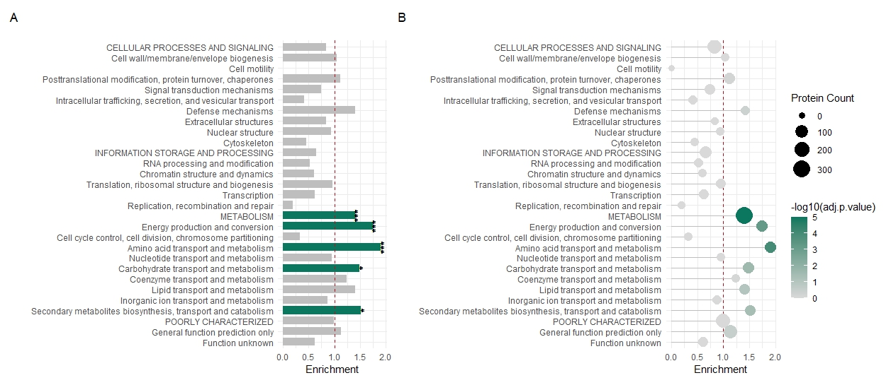
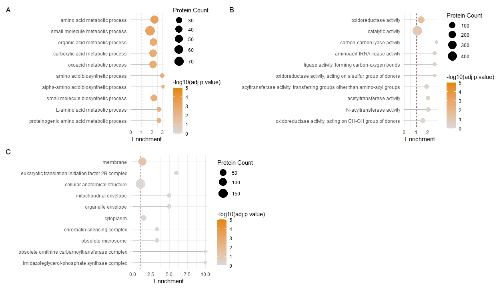
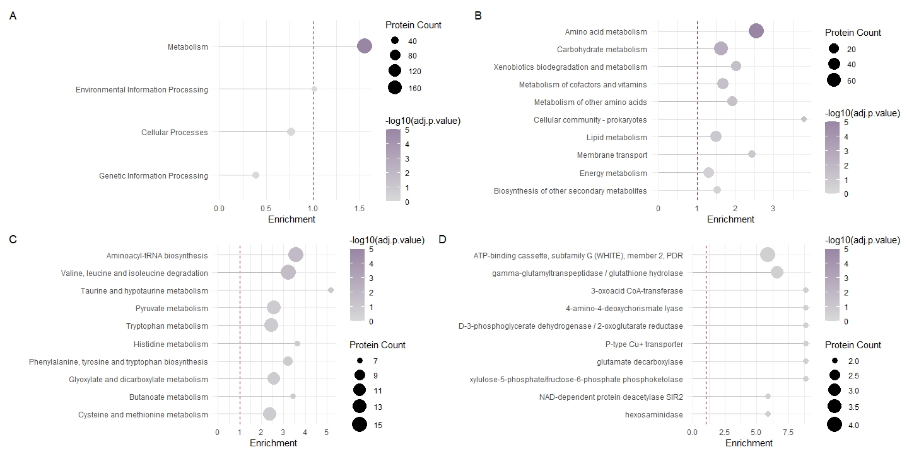

# FunFEA: an R Package for Fungal Functional Enrichment Analysis

### Overview  
*FunFEA* is an R package for functional enrichment analysis of fungal genomes. It allows users to build enrichment-ready models from COG/KOG, GO, and KEGG pathway annotations and perform enrichment analysis using transcriptomics or proteomics data. 

Key features:  
- Supports COG/KOG, GO, and KEGG pathway enrichment analysis from publicly available or *eggNOG-mapper* annotations.  
- Includes pre-generated models for commonly studied fungal species.  
- Provides *ggplot2*-based visualization tools for enrichment results.  
- Compatible with *patchwork* for figure panel generation.  

### Installation  

You can install the [latest development version](https://github.com/julien-charest/funfea/tree/main/build) from GitHub:  

```r
# Install FunFEA dependencies if not already installed
install.packages(c("ggplot2", "tidyr", "igraph", "dplyr"), dependencies = TRUE)

# Install FunFEA from latest build
install.packages("/path/to/funfea_1.1.8.tar.gz", repos = NULL, type = "source")
```

### Using FunFEA
#### Loading Precomputed Models
FunFEA provides precomputed functional annotation models for commonly studied fungal species. These models can be easily loaded using the *fetch_models()* function.

```r
# Load FunFEA
library(funfea)

# Fetch precomputed models for a given organism (e.g. Trichoderma reesei (QM6a))
t.reesei_qm6a <- fetch_models("Trichoderma reesei (QM6a)")
```

#### Computing Enrichments
Once a precomputed model has been loaded, enrichment analysis can be performed using the *kog_enrichment()*, *go_enrichment()*, or *kegg_enrichment()* functions, depending on the functional annotation type, and a *protein_ids* vector, corresponding to differentially abundant proteins from an RNA-seq or proteomics experiment.

##### KOG Enrichment Analysis
```r
# Perform KOG enrichment analysis
kog_enrichment_df <- kog_enrichment(t.reesei_qm6a$kog, protein_ids, test = "fisher", p.adjust.method = "BH")

# Generate KOG plot
generate_kog_plot(kog_enrichment_df, plot_type = "barplot")
generate_kog_plot(kog_enrichment_df, plot_type = "lollipop")
```


##### GO Enrichment Analysis
```r
# Perform GO enrichment analysis
go_enrichment_df <- go_enrichment(t.reesei_qm6a$go, protein_ids, test = "fisher", p.adjust.method = "BH")

# Generate GO plots
generate_go_plot(go_enrichment_df, gotermType = "biological_process", n = 10, plot_type = "lollipop")
generate_go_plot(go_enrichment_df, gotermType = "molecular_function", n = 10, plot_type = "lollipop")
generate_go_plot(go_enrichment_df, gotermType = "cellular_component", n = 10, plot_type = "lollipop")
```


##### KEGG Enrichment Analysis
```r
# Perform KEGG enrichment analysis
kegg_enrichment_df <- kegg_enrichment(t.reesei_qm6a$kegg, protein_ids, test= "fisher", p.adjust.method= "BH")

# Generate GO plots
generate_kegg_plot(kegg_enrichment_df, model = "pathway_type", n = 10, plot_type = "lollipop")
generate_kegg_plot(kegg_enrichment_df, model = "pathway_class", n = 10, plot_type = "lollipop")
generate_kegg_plot(kegg_enrichment_df, model = "pathway_name", n = 10, plot_type = "lollipop")
generate_kegg_plot(kegg_enrichment_df, model = "definition", n = 10, plot_type = "lollipop")
```


#### Utility Functions
FunFEA includes several utility functions to assist in handling gene, transcript, and protein ID conversions. These functions allow users to efficiently process annotation files and map identifiers for downstream enrichment analysis.
```r
# Loading a GTF/GFF Annotation
gtf_df <- load_gtf_annotation("path/to/annotation")

# Create a conversion dataframe from the annotation
transcript2protein_id_df <- create_transcript2protein_id_df(gtf_df)

# Convert a list of transcript IDs to protein IDs
protein_ids <- transcript2protein_id(transcript_ids, transcript2protein_id_df)

# Converting gene names to protein IDs
protein_ids <- gene2protein_id(gene_ids, transcripts2proteins_df)
```

#### Creating Functional Models from Annotation Files
If precomputed models are not available for your organism, FunFEA allows users to generate COG/KOG, GO, and KEGG pathway models directly from functional annotations. This is particularly useful when working with novel species or custom annotations. Functional models can be also be created using annotation data from *eggNOG-mapper*, a widely used tool for functional annotation of protein sequences.

##### Generating Models from Public Annotations
```r
# Generate KOG model
kog_annotation_df <- load_kog_annotation(path/to/KOG/annotation)
kog_model_df <- create_kog_model(kog_annotation_df)

# Generate GO models
go_annotation_df <- load_go_annotation(path/to/GO/annotation)
go_model_df <- create_go_model(go_annotation_df)

# Generate KEGG pathway models (from KEGG annotation)
kegg_annotation_df  <- load_kegg_annotation(path/to/KEGG/annotation)
kegg_model_df <- create_kegg_model(kegg_annotation_df)

# Generate KEGG pathway models (from EC annotation)
ec_annotation_df  <- load_ec_annotation(path/to/EC/annotation)
kegg_model_df <- create_kegg_model_from_ec(ec_annotation_df)
```

##### Generating Models from *eggNOG-mapper* Annotation
```r
# Load eggnog-mapper annotation
eggnog_annotation_df <- load_eggnog_annotation(path/to/eggnog/annotation)

# Generate KOG model
kog_model_df <- create_kog_model_eggnog(eggnog_annotation_df)

# Generate GO models
go_model_df <- create_go_model_eggnog(eggnog_annotation_df)

# Generate KEGG pathway models (from KEGG annotation)
kegg_model_df <- create_kegg_model_eggnog(eggnog_annotation_df)
```

### **Available Precomputed Models**  

The following fungal species have precomputed COG/KOG, GO, and KEGG pathway models available for direct use with *FunFEA*:  

| **Species**                      | **Strain**        |
|-----------------------------------|------------------|
| *Aspergillus fumigatus*          | Af293            |
| *Aspergillus nidulans*           | FGSC A4         |
| *Aspergillus niger*              | ATCC 1015       |
| *Aureobasidium pullulans*        | EXF-150         |
| *Candida albicans*               | SC5314          |
| *Fusarium oxysporum*             | Fo47            |
| *Neurospora crassa*              | OR74A           |
| *Pichia pastoris*                | GS115           |
| *Saccharomyces cerevisiae*       | S288C           |
| *Schizosaccharomyces pombe*      | 972h-           |
| *Penicillium chrysogenum*        | 4088766         |
| *Trichoderma asperellum*         | CBS 433.97      |
| *Trichoderma atroviride*         | IMI 206040      |
| *Trichoderma reesei*             | QM6a            |
| *Trichoderma reesei*             | RUT C-30        |
| *Trichoderma virens*             | Gv29-8          |

To load a precomputed model, use:  

```r
models <- fetch_models("Species (Strain)")
```
